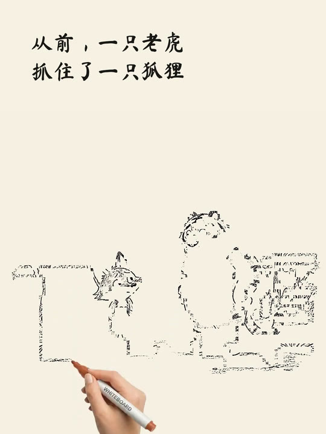
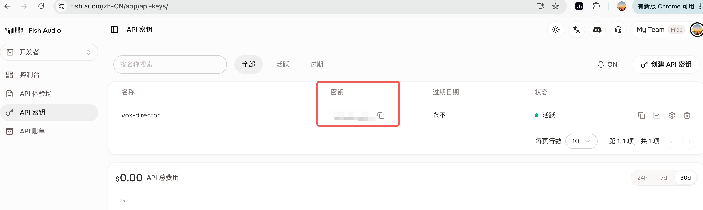

# One Word to Hand-drawn

把一个词、成语、主题或短故事制作成 3:4 彩色白板手绘视频：上方文字独立书写，
下方画面由真实手持画笔依次完成线稿和上色。支持 Fish Audio 配音，也支持完全无声。

## 效果预览

<table>
  <tr>
    <td align="center"><strong>手绘进行中</strong></td>
    <td align="center"><strong>完成画面</strong></td>
  </tr>
  <tr>
    <td></td>
    <td></td>
  </tr>
</table>

成片规格：

- 3:4 竖屏，1080×1440，30 fps，H.264
- 原版手写文字揭示效果；画手只出现在下方插画区域
- 线稿完成后逐步上色，画面完成约 0.1 秒后切换
- 配音模式按真实旁白长度安排镜头，减少声音结束后的停格

## 安装

可以直接在 Codex 中发送：

```text
请安装这个 Skill：
https://github.com/hongtao520/oneword-to-handdrawn
```

也可以手动克隆。

macOS / Linux：

```bash
git clone https://github.com/hongtao520/oneword-to-handdrawn.git \
  ~/.codex/skills/oneword-to-handdrawn
```

Windows PowerShell：

```powershell
git clone https://github.com/hongtao520/oneword-to-handdrawn.git `
  "$HOME\.codex\skills\oneword-to-handdrawn"
```

如果已经安装：

```bash
git -C ~/.codex/skills/oneword-to-handdrawn pull
```

重新打开 Codex 任务后即可识别 `$oneword-to-handdrawn`。

### 运行依赖

只需要：

- Python 3.9 或更高版本
- 能够访问 GitHub、PyPI、npm 和 Node.js 官方下载站的网络

Skill 会优先复用系统中已有的 Node.js 20+ 和 FFmpeg；缺少时自动安装私有副本到
`~/.cache/oneword-to-handdrawn/`。YangAgent 绘图依赖、Remotion、Chrome Headless
Shell 也会在首次制作时自动安装，不要求用户手动配置全局 Node.js 或 FFmpeg。

## 快速使用

默认制作有配音版本：

```text
使用 $oneword-to-handdrawn，把“狐假虎威”做成一个儿童手绘故事视频。
```

制作无声版本：

```text
使用 $oneword-to-handdrawn，把“守株待兔”做成手绘视频，不要配音。
```

也可以提供现成故事、分镜文字或按顺序排列的图片。Codex 会完成故事拆分、插画、
手绘动画、文字效果、音画同步和最终导出。

## Fish Audio 配音密钥

只有制作配音版本时才需要 `FISH_API_KEY`。无声版本不需要 Fish Audio 账号或密钥。

默认配音设置：

- 模型：`s2.1-pro-free`
- 音色：`儿童故事女声`
- Reference ID：`7b248932fa704935ae2cd0fc1ed374fe`

Fish Audio 的可用额度、计费和模型政策以用户自己的 Fish Audio 账号页面为准。

### 获取 Fish Audio API Key

1. 登录 [Fish Audio API 密钥页面](https://fish.audio/zh-CN/app/api-keys/)。
2. 点击右上角“创建 API 密钥”。
3. 复制生成的密钥，然后使用下面的配置器保存；不要把密钥粘贴到聊天或 GitHub。



进入 Skill 目录后运行：

```bash
python3 scripts/configure_fish.py
```

Windows 使用：

```powershell
python scripts\configure_fish.py
```

配置器会隐藏输入内容，将密钥保存到 Skill 根目录的 `.env`，该文件已被
`.gitignore` 排除，不会提交到 GitHub。检查配置时也不会显示密钥：

```bash
python3 scripts/configure_fish.py --check
```

密钥查找顺序：

1. 环境变量 `FISH_API_KEY`
2. `oneword-to-handdrawn/.env`
3. 已安装的 `~/.codex/skills/vox-agent/.env`

如果已经为 [vox-agent](https://github.com/hongtao520/vox-agent) 配置过 Fish Audio，
本 Skill 会自动复用其中的 `FISH_API_KEY`，不需要重复输入。

如果配音模式没有找到密钥，Skill 会在生成故事素材前停止，并提示密钥创建地址和
配置命令；不会自动换成其他音色或系统语音。

### 更换音色

成片后可以直接对 Codex 说：

```text
保持画面不变，把配音换成温柔成年女声。
```

也可以提供 Fish Audio 音色名称和 Reference ID。Skill 会复用已有无声母版，只重新
生成和装配旁白，不会重复生成图片或手绘动画。

## 手动运行

通常只需在 Codex 中描述想要的视频。需要调试时，可按下面顺序执行：

```bash
# 配音版预检：先检查 Fish 密钥，再自动准备依赖
python3 scripts/preflight.py --mode voiced

# 无声版预检
python3 scripts/preflight.py --mode silent

# 初始化项目
python3 scripts/init_project.py \
  --project /absolute/path/to/project \
  --title "狐假虎威" \
  --scenes 7

# 填写 storyboard.json 并放入图片后
python3 scripts/validate_project.py /absolute/path/to/project
python3 scripts/build_video.py /absolute/path/to/project --mode voiced
```

无声构建将最后一行改为：

```bash
python3 scripts/build_video.py /absolute/path/to/project --mode silent
```

## 输出文件

- 无声母版：`<project>/out/picture_silent.mp4`
- 配音成片：`<project>/out/picture_voiced.mp4`
- 镜头时间报告：`<project>/out/timing.json`
- 单镜头手绘片段：`<project>/work/clips/`

配音项目也会保留无声母版，便于日后更换音色。

## 致谢与许可

- 白板手绘阶段运行时下载并固定使用
  [yangagent/whiteboard-animation-skill](https://github.com/yangagent/whiteboard-animation-skill)
  的指定提交。
- 文字揭示组件参考
  [gnipbao/story-to-handdrawn-video](https://github.com/gnipbao/story-to-handdrawn-video)。
- Fish Audio 密钥截图复用自
  [hongtao520/vox-agent](https://github.com/hongtao520/vox-agent)。

本仓库采用 [MIT License](./LICENSE)。
